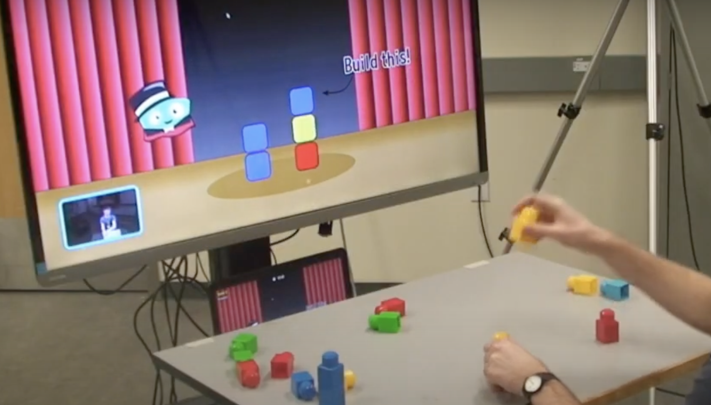

# pearl-lab-software-dev

Computer vision algorithm development for *Bootle Blast*, a mixed-reality therapy tool built at Pearl Lab (Holland Bloorview Kids Rehabilitation Hospital).

## About the Project

*Bootle Blast* is a therapeutic game designed by Pearl Lab at Holland Bloorview Kids Rehabilitation Hospital and built using the Unity game engine. It currently features 15 unique mini-games, each aimed at supporting and reinforcing various movement patterns — from upper to lower limb motion. Of these 15 games, 5 incorporate mixed-reality elements, requiring players to grasp and move real-world objects to translate their movements into in-game actions. The focus of this repository is improving the detection system for the mini-game **Magic Block**, which uses color-coded physical blocks (blue, red, yellow, green). In this game, players copy a stack of colored blocks displayed on screen. Points are awarded based on how closely the real-life stack matches the on-screen configuration in both color and order. Bootle Blast uses a 3D camera-computer (Orbbec Persee) and body tracking software to capture 19 distinct skeletal landmarks. It also uses an RGB camera to detect and identify the colored blocks. This data is valuable for tracking physical rehabilitation progress and measuring changes over time.
Currently, a combination of skeletal tracking and RGB input is used to monitor both the player and the physical objects. However, the detection algorithm faces several challenges, including inaccurate recognition when blocks are partially occluded, reduced tracking accuracy when there is significant distance between the player and the camera, and difficulty in detecting fine hand movements.

  

The goal of this repository is to develop modern and alternative computer vision tools to address these challenges and improve the system’s robustness and accuracy. Specifically, we are exploring:
- Integration of modern libraries like **YOLOv8**
- Use of **fiducial markers** (e.g., AprilTags) to improve tracking
- Making the system more accessible to users without access to a 3D camera or specifically colored blocks

To learn more about Pearl Lab, Bootle Blast’s mini-games, and in-game lore, visit the [Pearl Lab website](https://hollandbloorview.ca/research-education/bloorview-research-institute/research-centres-labs/pearl-lab).

## YOLOv8 for Object Detection

I trained a **YOLOv8** model to detect colored blocks using a custom dataset of real-world images in custom home settings.

### Data Collection

1. **Environment Setup**  
   To mimic diverse real-life conditions, photos were captured under a wide range of settings:
   - Distance: Near and far from the camera
   - Lighting: Bright, dim, single lamp, double lamps, natural light from windows
   - Visibility: With and without occlusion (e.g., partially blocked fiducial markers)

   These variations were intentional to help the YOLOv8 model generalize better and perform accurately in real-world scenarios.

2. **Camera**
  Images were captured using both a 3D Orbbec Persee camera and a standard 2D webcam. This combination allowed us to gather diverse visual data, including depth-aware and RGB-only perspectives,     enhancing the robustness of the training dataset.
  
4. **Image Annotation via [CVAT.ai](https://cvat.ai)**  
   - Annotated over **150+ images**, each image has at least 3 instances of a block.
   - There are four classes: red, blue, yellow and green.
   - Exported in YOLO format for training

     

  

### Model Training with YOLOv8

YOLOv8 was selected for its high speed and accuracy in real-time object detection tasks. The training process was carried out using the Ultralytics Python interface, which streamlined dataset loading, augmentation, and optimization. After training, the model's best-performing weights were saved as best.pt for use in inference and deployment.

---

## Web-Based Detection Demo

A lightweight demo was developed to run the trained YOLOv8 model in real-time:

- **Backend:** Python & Flask  
- **Frontend:** HTML, CSS, JavaScript  
- **Detection:** OpenCV + YOLOv8 for live detection

  

## License

This project is licensed under the [MIT License](LICENSE).
